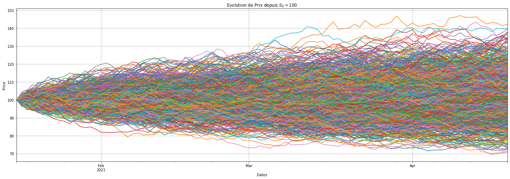
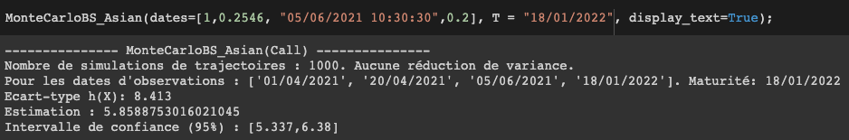

<h1>Option Pricing </h1>

 

Coded in **Numpy/Pandas**

Mathematical formulations and full project available in pdf.

## Black & Scholes and Monte Carlo methods
  - *Class BS* : Black & Scholes closed formula and the main associated greeks
  - *Class MonteCarloBS (parent)* | *Class MonteCarloEuropeanApplication* : Monte Carlo for Call & Put 
  - *Class MonteCarloBS_Basket* : Monte-Carlo application for a basket of assets
  
## Asian options pricing and variance reduction
  - *Class MonteCarloBSPathDependant*: dates in numeric fractions or TimeStamp pandas for pricing (precision : seconds) 
  - *Class MonteCarloBS_Asian*
    - exemple output : 
  - Variance reduction by antithetical and control variables
    
## Pricing Options with Up&In, Down&Out barriers
- *Class MonteCarloBS_UpAndOut* | *Class MonteCarloBS_DownAndIn*
- Variance Reduction by Conditional Monte Carlo

## PDE for Black & Scholes
- Solving the Black & Scholes equation using PDE

## EDS for Black & Scholes and Heston model
- *Class EDS* | *Class EDS_BS* : approximation of the BS solution by Euler and Milstein scheme
- *Class Heston*: Heston model for stochastic volatility, deriving from MonteCarloBS and EDS classes.
  - Volatility Smile
  - Evolution of the smile as a function of the parameters

